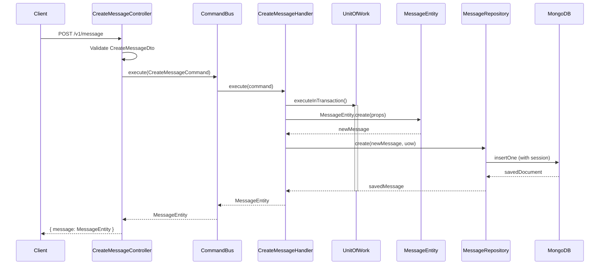

# Create Message Flow

## Description

Creates a new message within a conversation. The flow follows the **Command Handler Pattern** with transactional support via Unit of Work.

### Request Body

| Field            | Type                   | Required | Description                      |
| ---------------- | ---------------------- | -------- | -------------------------------- |
| `tenantId`       | `string`               | Yes      | The tenant identifier            |
| `conversationId` | `string`               | Yes      | The conversation to add message  |
| `senderId`       | `string`               | Yes      | The sender's identifier          |
| `content`        | `string`               | Yes      | The message content              |
| `metadata`       | `Record<string, any>`  | No       | Optional metadata key-value pairs|

#### Example
```json
{
  "tenantId": "tenant-001",
  "conversationId": "conv-12345",
  "senderId": "user-789",
  "content": "Hello, world!",
  "metadata": {
    "priority": "high",
    "tags": ["greeting"]
  }
}
```

### Response

Returns the created `MessageEntity` wrapped in a `message` object.

#### Example
```json
{
  "message": {
    "id": "507f1f77bcf86cd799439011",
    "tenantId": "tenant-001",
    "conversationId": "conv-12345",
    "senderId": "user-789",
    "content": "Hello, world!",
    "timestamp": "2025-12-13T10:30:00.000Z",
    "metadata": {
      "priority": "high",
      "tags": ["greeting"]
    }
  }
}
```

### Error Handling

| Error                    | Code                  | Description                              |
| ------------------------ | --------------------- | ---------------------------------------- |
| `SaveMessageFailedError` | `SAVE_MESSAGE_FAILED` | Database or transaction failure          |
| Validation Error         | `400`                 | Missing required fields in request body  |

## Flow

1. **Controller** (`CreateMessageController`)
   - Receives POST request at `/v1/message`
   - Validates input via `CreateMessageDto`
   - Constructs `CreateMessageCommand` with request data
   - Dispatches command via `CommandBus`

2. **Command Handler** (`CreateMessageHandler`)
   - Executes within a database transaction (`UnitOfWork`)
   - Creates `MessageEntity` via domain factory method
   - Persists message via `MessageRepository`
   - Returns the saved entity

3. **Domain Entity** (`MessageEntity`)
   - Factory method `create()` auto-generates timestamp
   - Validates business rules (e.g., content cannot be empty)

4. **Repository** (`MessageRepository`)
   - Persists to MongoDB within the transaction context


## Sequence Diagram


