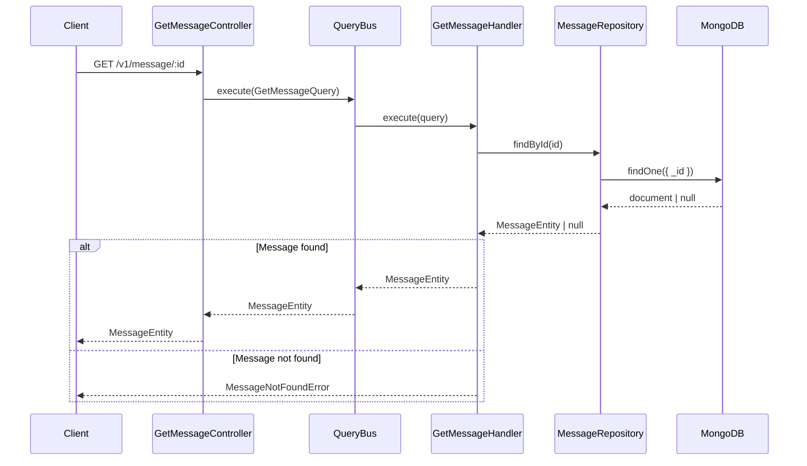

# Get Message Flow

## Description

Retrieves a single message by its ID. The flow follows the **Query Handler Pattern**.

### Request

| Parameter | Type     | Location | Required | Description          |
| --------- | -------- | -------- | -------- | -------------------- |
| `id`      | `string` | Path     | Yes      | The message ObjectId |

#### Example

```
GET /v1/message/507f1f77bcf86cd799439011
```

### Response

Returns the `MessageEntity` directly.

#### Example
```json
{
  "id": "507f1f77bcf86cd799439011",
  "tenantId": "tenant-001",
  "conversationId": "conv-12345",
  "senderId": "user-789",
  "content": "Hello, world!",
  "timestamp": "2025-12-13T10:30:00.000Z",
  "metadata": {
    "priority": "high",
    "tags": ["greeting"]
  }
}
```

### Error Handling

| Error                  | Code                | Description                          |
| ---------------------- | ------------------- | ------------------------------------ |
| `MessageNotFoundError` | `MESSAGE_NOT_FOUND` | Message with the given ID not found  |

## Flow

1. **Controller** (`GetMessageController`)
   - Receives GET request at `/v1/message/:id`
   - Extracts `id` from path parameter
   - Constructs `GetMessageQuery` with the ID
   - Dispatches query via `QueryBus`

2. **Query Handler** (`GetMessageHandler`)
   - Calls `MessageRepository.findById()`
   - Throws `MessageNotFoundError` if message doesn't exist
   - Returns the `MessageEntity`

3. **Repository** (`MessageRepository`)
   - Queries MongoDB by ID

## Sequence Diagram




