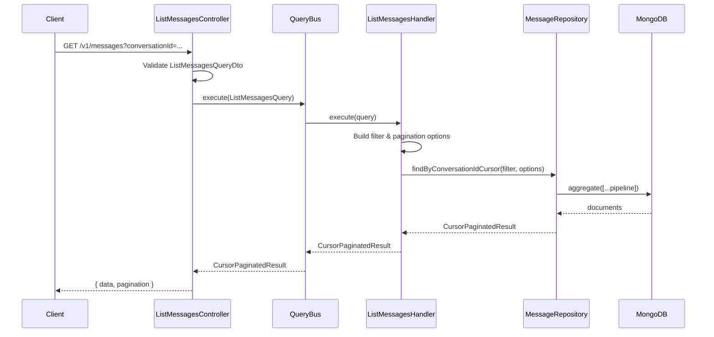

# List Messages Flow

## Description

Retrieves a paginated list of messages for a specific conversation with filtering and sorting options. The flow follows the **Query Handler Pattern** with cursor-based pagination.

### Request

| Parameter        | Type        | Location | Required | Default     | Description                              |
| ---------------- | ----------- | -------- | -------- | ----------- | ---------------------------------------- |
| `conversationId` | `string`    | Query    | Yes      | -           | The conversation ID to filter messages   |
| `tenantId`       | `string`    | Query    | No       | -           | Filter by tenant                         |
| `senderId`       | `string`    | Query    | No       | -           | Filter by sender                         |
| `startDate`      | `string`    | Query    | No       | -           | Filter messages after this date (ISO 8601) |
| `endDate`        | `string`    | Query    | No       | -           | Filter messages before this date (ISO 8601) |
| `searchText`     | `string`    | Query    | No       | -           | Search text in message content           |
| `cursor`         | `string`    | Query    | No       | -           | Pagination cursor (base64 encoded)       |
| `limit`          | `number`    | Query    | No       | `20`        | Number of items (1-100)                  |
| `sortBy`         | `string`    | Query    | No       | `timestamp` | Field to sort by                         |
| `sortOrder`      | `asc\|desc` | Query    | No       | `desc`      | Sort order                               |

#### Example

```
GET /v1/messages?conversationId=conv-12345&limit=10&sortOrder=desc
```

### Response

Returns a cursor-paginated result with messages and pagination metadata.

#### Example
```json
{
  "data": [
    {
      "id": "507f1f77bcf86cd799439011",
      "tenantId": "tenant-001",
      "conversationId": "conv-12345",
      "senderId": "user-789",
      "content": "Hello, world!",
      "timestamp": "2025-12-13T10:30:00.000Z",
      "metadata": {}
    },
    {
      "id": "507f1f77bcf86cd799439012",
      "tenantId": "tenant-001",
      "conversationId": "conv-12345",
      "senderId": "user-456",
      "content": "Hi there!",
      "timestamp": "2025-12-13T10:29:00.000Z",
      "metadata": {}
    }
  ],
  "pagination": {
    "limit": 10,
    "hasMore": true,
    "nextCursor": "eyJ0aW1lc3RhbXAiOjE3MDI0NjM3NDAwMDB9",
    "previousCursor": null
  }
}
```

### Error Handling

| Error            | Code  | Description                  |
| ---------------- | ----- | ---------------------------- |
| Validation Error | `400` | Invalid query parameters     |

## Flow

1. **Controller** (`ListMessagesController`)
   - Receives GET request at `/v1/messages`
   - Validates query parameters via `ListMessagesQueryDto`
   - Constructs `ListMessagesQuery` with filters and pagination options
   - Dispatches query via `QueryBus`

2. **Query Handler** (`ListMessagesHandler`)
   - Builds filter object from query parameters
   - Builds pagination options (cursor, limit, sort)
   - Calls `MessageRepository.findByConversationIdCursor()`
   - Returns cursor-paginated result

3. **Repository** (`MessageRepository`)
   - Queries MongoDB with filters
   - Applies cursor-based pagination
   - Returns paginated result with next/previous cursors

## Sequence Diagram




