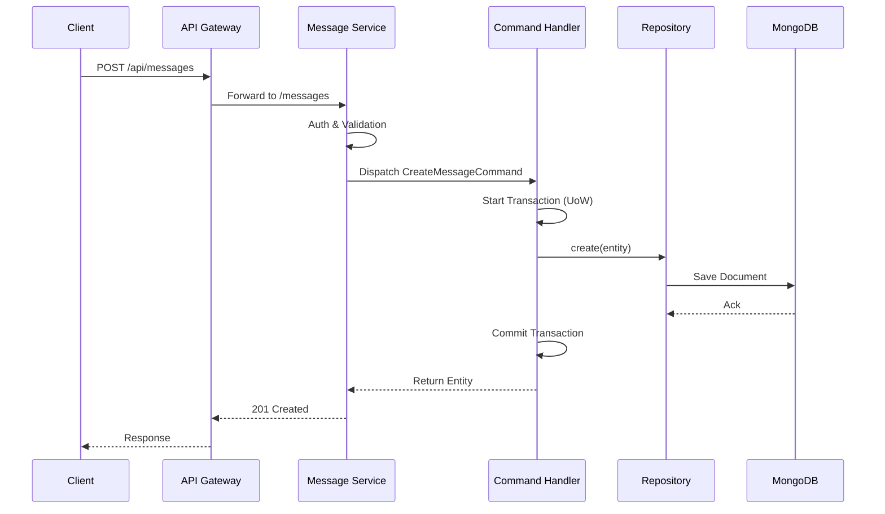

# Data Flow & Control Flow

Understanding the request lifecycle is crucial for debugging and extending the system.

## Request Lifecycle (Synchronous)

When a client sends a request (e.g., `POST /api/messages`), it traverses the following layers:

### 1. Gateway Proxy
The `api-gateway` uses `http-proxy-middleware` to route the request based on the path mapping in `proxy-config.json`.
- **Path**: `/api/messages/**` -> `http://localhost:3001/messages/**`

### 2. Service Entry (Controller)
The target service (e.g., `message-service`) receives the request. The controller:
1. Validates the input using `ValidationPipe`.
2. Extracts session data (Tenant ID, User ID) via `ClerkAuthGuard`.
3. Dispatches a **Command** via the NestJS `CommandBus`.

### 3. Business Logic (Handler)
The **Command Handler** receives the command and orchestrates the business operation:
1. Initiates a database transaction via **Unit of Work**.
2. Loads or creates a **Domain Entity**.
3. Persists the changes within the transaction.

## Sequence Diagram

## Async Flow (Future)

The system is designed to support the **Outbox Pattern** for reliable event propagation.

1. **Transaction**: Save Business Data + Save Outbox Event in the *same* DB transaction.
2. **CDC (Change Data Capture)**: A separate service watches the Outbox collection.
3. **Publisher**: Events are published to **Kafka**.

> [!NOTE]
> The Outbox/Kafka infrastructure is currently under development. See the [Roadmap](/quickstart#roadmap) for details.
