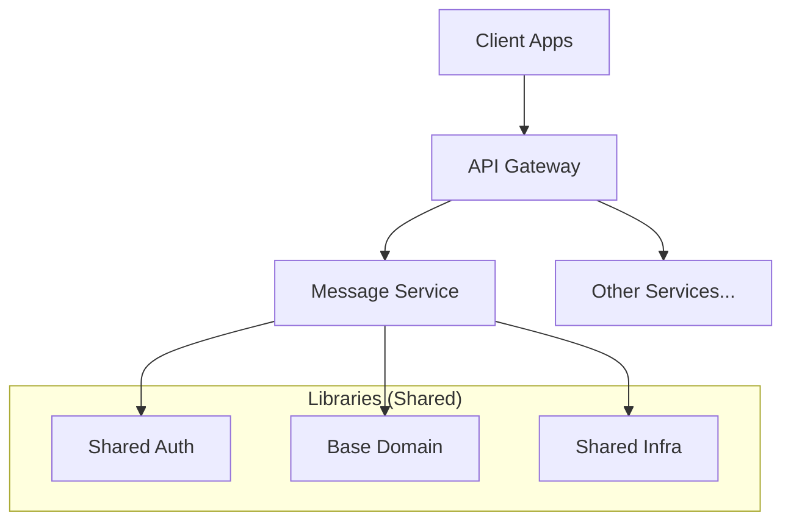

# System Overview

The Boilerplate system is a **multi-tenant, modular monorepo** designed for scalability, maintainability, and enterprise-grade messaging workflows.

## Core Architectural Pillars

### 1. Unified Monorepo (Nx)
We use **Nx** to manage our codebase. This allows us to share code horizontally across services while maintaining strict boundary checks and efficient build/test cycles.

### 2. Clean Architecture & DDD
Each domain is isolated using Domain-Driven Design principles. We separate our logic into three distinct layers:
- **Domain**: Pure business logic and entities. No infrastructure dependencies.
- **Application**: Use cases, command handlers, and orchestration.
- **Infrastructure**: Concrete implementations (MongoDB, NestJS modules, external APIs).

### 3. Centralized API Gateway
Instead of exposing internal services directly, we use a lightweight **API Gateway proxy**. This provides a single point of entry, handles global concerns like SSL and CORS, and simplifies service discovery for clients.

## High-Level Diagram

> [!IMPORTANT]
> **Why separate services?**  
> Even in a monorepo, we design services to be logically independent. This allows us to scale them individually or move them to separate infrastructure if needed without rewriting the business logic.

---

## Technical Stack
- **Framework**: [NestJS](https://nestjs.com/)
- **Runtime**: Node.js
- **Database**: [MongoDB](https://www.mongodb.com/) (using Mongoose)
- **Auth**: [Clerk](https://clerk.dev/)
- **Monorepo**: [Nx](https://nx.dev/)
