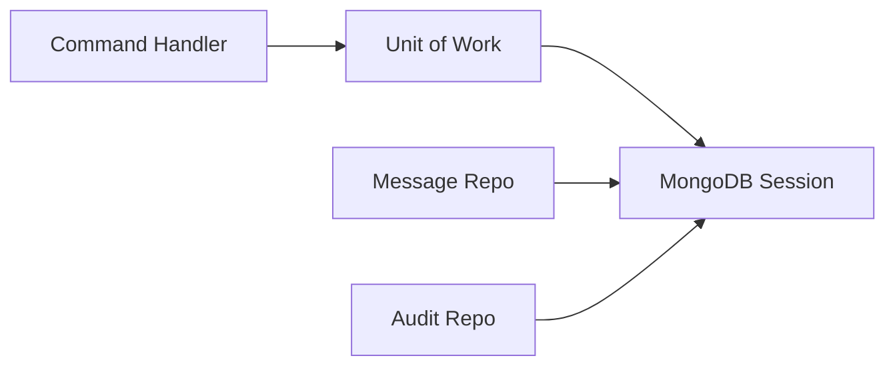

# Persistence Layer

We use **MongoDB** as our primary data store, providing flexibility for varied message formats while maintaining relational-like consistency through architectural patterns.

## MongoDB Schema Patterns

Every document inherits from a **Base Schema** located in `libs/shared/infra`. This ensures consistent auditing and concurrency control.

### Common Fields
- `_id`: Unique object ID.
- `version`: Used for **Optimistic Locking**.
- `metadata`: Flexible key-value store for extensible data without schema migrations.
- `tenantId`: Strict isolation field (mandatory for all queries).

## Concurrency Control

We implement **Optimistic Locking** to prevent "lost updates" in high-concurrency scenarios.

```typescript
// Example from MessageRepository
async update(entity: MessageEntity): Promise<MessageEntity> {
  const updated = await this.messageModel.findOneAndUpdate(
    {
      _id: entity.id,
      version: entity.version, // Verify version matches
    },
    {
      $set: { content: entity.content },
      $inc: { version: 1 },    // Atomic increment
    }
  );
  if (!updated) throw new OptimisticLockError();
}
```

## Unit of Work (UoW)

To ensure atomicity across multiple repository calls, we use the `MongooseUnitOfWork`.

> [!TIP]
> **Why UoW?**  
> It keeps our Domain layer free from database-specific transaction logic. The handler only knows it's executing "in a transaction", regardless of the underlying DB driver.



---

## Pagination Strategies

We support two modes of data retrieval:
1. **Offset-based**: Good for simple tables, uses `page` and `limit`.
2. **Cursor-based**: Optimized for infinite scrolls and large datasets, uses `nextCursor` and `previousCursor` (Base64 encoded).
