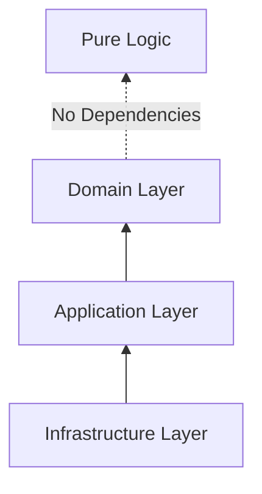

# Repository Structure

The repository follows a strict modular structure to ensure that dependencies flow in the right direction.

## Directory Map

### `/apps`
Contains deployable applications.
- **`api-gateway`**: Routes requests to internal services via a JSON-based proxy config.
- **`message-service`**: The primary microservice handling core messaging logic.
- **`backstage`**: An internal developer portal (based on Spotify's Backstage) for service discovery and documentation.

### `/libs`
Shared code organized by domain or utility.

#### `/libs/messages`
- **`messages-domain`**: Contains the `MessageEntity` and repository interfaces. Must remain dependency-free.
- **`messages-application`**: Implementation of Command/Query handlers (use cases).
- **`messages-infra`**: Mongoose schemas and concrete repository implementations.

#### `/libs/shared`
- **`auth`**: Clerk-specific guards and decorators.
- **`domain`**: Base classes like `BaseEntity` and `UnitOfWork` interfaces.
- **`infra`**: Generic infrastructure tools like `MongooseUnitOfWork`.
- **`http`**: Unified error handling and response formatting.

## Dependency Guidelines

To maintain "Clean Architecture", we follow these strict rules:
1. **Infrastructure** can depend on **Application** and **Domain**.
2. **Application** can depend on **Domain**.
3. **Domain** MUST NOT depend on anything.

---

## Best Practices
- **New Feature?** Always start in the `domain` library.
- **External API?** Define an interface in the `domain` and implement it in `infra`.
- **New Service?** Add it to `apps/` and update `proxy-config.json` in the gateway.
